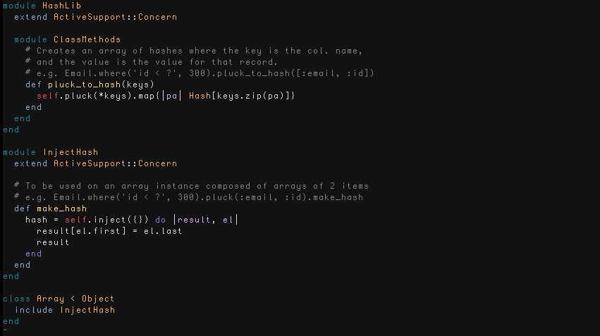
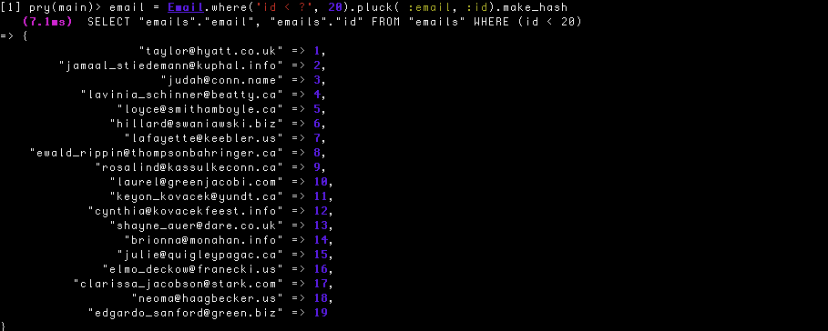
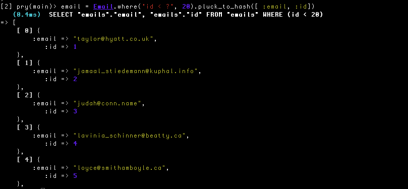

ChefEmail
========

Demo of Using AngularJS for Rails Frontend
------------------------------------------

- Ruby version: 2.2.2p95
- Rails: 4.2.5.2

Synopsis
--------

- This app is a demonstration of a SPA.
- It also implements an infinite scroll via AngularJS

Gem dependencies
---------------
- gon
- bower-rails
- angular-rails-templates
  This ensures that Angular assets are served properly in the Rails Assets pipeline
- responders (for responds to, etc)

Hash Helpers
--------------

controllers/concerns has a couple of handy methods for building simple hashes:

Example using make\_hash:

Example using pluck\_to\_hash:

### Rails API

App also has example of using Rails API to upload a large query in the background
with Angular.js

Copyright
--------

[Copyright]( http://jet.mit-license.org/  ) by Jerrold R Thompson
